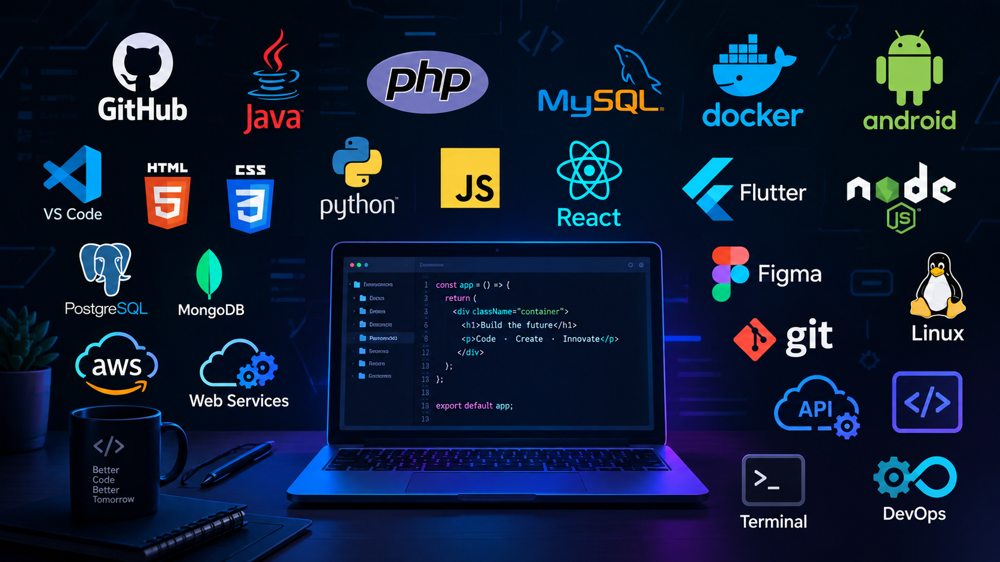

# Hi there 👋
## I'm Luis Lugo

#### Developer/ Programmer/ Data Bases/ User Support/ Technical Support and System Maintenance.
#### Full Stack Developer with over 7 years of experience in software development and professional application and system design.
#### Broad experience with programming languages, Frameworks, and data bases, as well as system support and maintenance for enterprise systems. Additionally, basic knowledge in developing native Android mobile applications.

🔭 I’m currently working on upload a project, conecting git with github
🌱 I’m currently learning Flutter Apps developing
😄 I've been taking a course about Python
⚡ In some weeks I'm going to learn about Firebase
<!--
**LuisLugo-Laboratory/LuisLugo-Laboratory** is a ✨ _special_ ✨ repository because its `README.md` (this file) appears on your GitHub profile.

Here are some ideas to get you started:

- 🔭 I’m currently working on ...
- 🌱 I’m currently learning ...
- 👯 I’m looking to collaborate on ...
- 🤔 I’m looking for help with ...
- 💬 Ask me about ...
- 📫 How to reach me: ...
- 😄 Pronouns: ...
- ⚡ Fun fact: ...
-->
